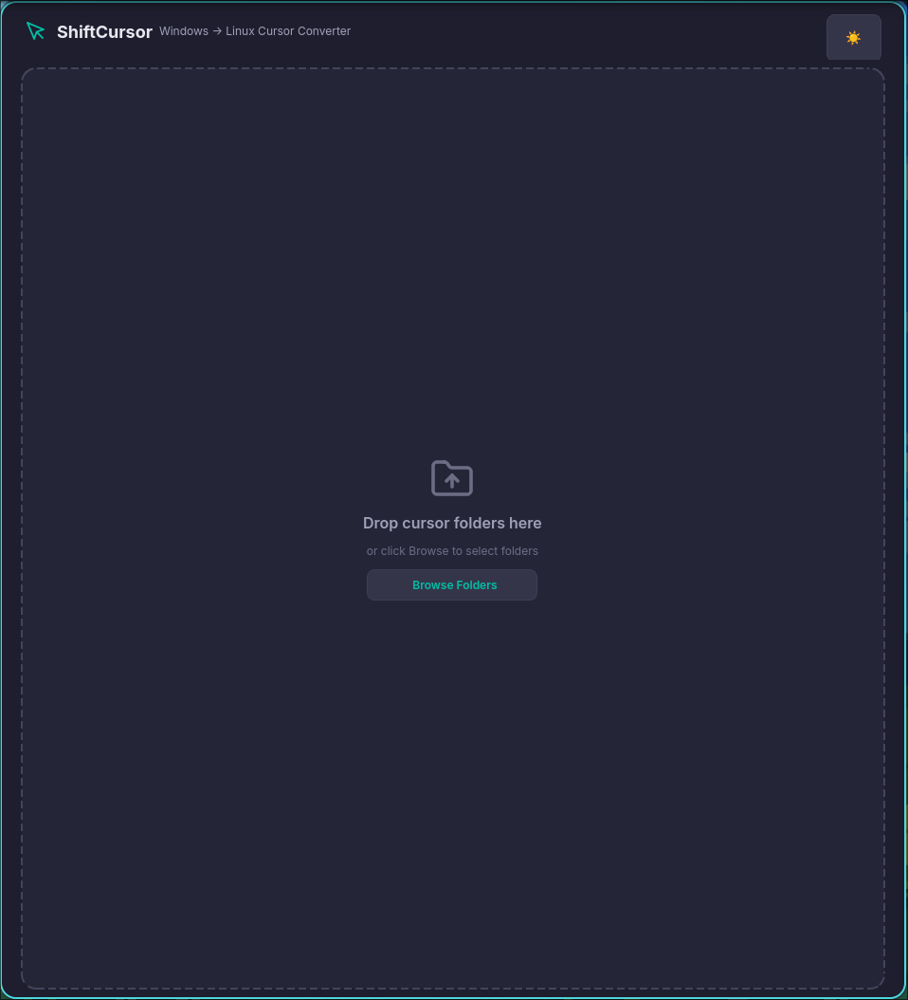
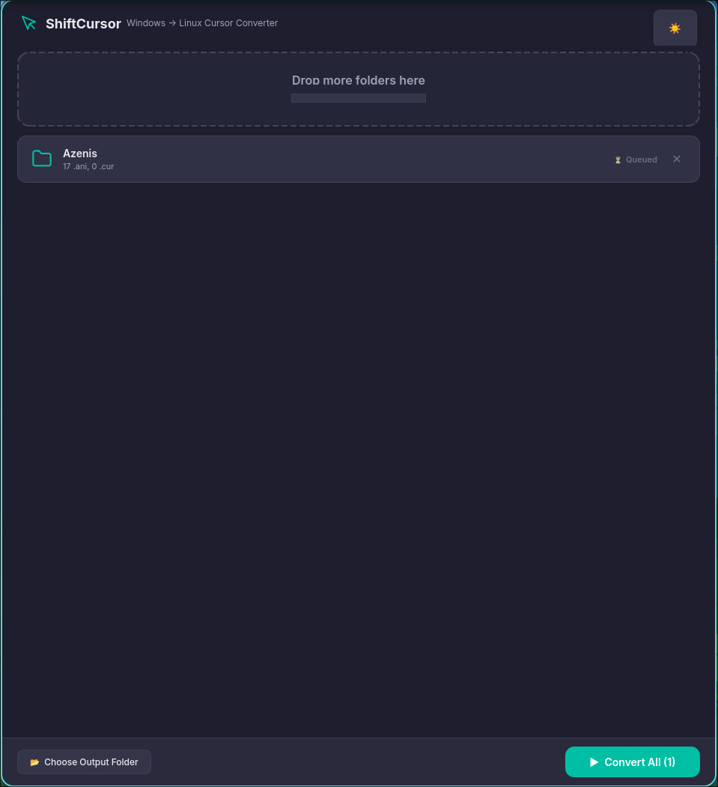

<div align="center">

# 🖱️ ShiftCursor

**Seamlessly convert Windows cursor themes to Linux — with a beautiful desktop GUI.**

[](https://www.python.org/)
[](https://doc.qt.io/qtforpython/)
[](LICENSE)
[](https://www.linux.org/)

---

*Tired of finding awesome Windows cursor packs but being stuck on Linux?*
*ShiftCursor bridges that gap — drag, drop, convert, install.*

</div>

---

## ✨ Features

| Feature | Description |
|---|---|
| 🎨 **Material Design 3 UI** | Dark & light themes with a polished, modern interface |
| 📂 **Drag & Drop** | Drop entire cursor folders straight into the app |
| ⚡ **Batch Conversion** | Convert multiple cursor packs at once with live progress tracking |
| 🔗 **Smart Name Mapping** | Automatically maps Windows cursor names to X11 equivalents via `.inf` parsing and fuzzy matching |
| 📦 **One-Click Install** | Install converted themes directly to `~/.local/share/icons/` |
| 🖼️ **Animated & Static** | Full support for both `.ani` (animated) and `.cur` (static) cursor files |
| 🧩 **Comprehensive Aliases** | Creates symlinks for all standard X11 cursor names so themes work everywhere |
| 🔧 **CLI Mode** | Prefer the terminal? Use `convert_cursors.py` for scriptable conversions |

---

## 📸 Screenshots

The app features a sleek drag-and-drop interface with real-time conversion progress cards.

<div align="center">
  
  &nbsp;&nbsp;
  
  &nbsp;&nbsp;
  
</div>

---

## 🚀 Getting Started

### Prerequisites

- **Python 3.10+**
- **Linux** (GNOME, KDE, XFCE, or any desktop using X11/Xcursor themes)
- **[win2xcur](https://github.com/nicman23/win2xcur)** — the engine that does the actual cursor format conversion

### Installation

1. **Clone the repository:**
   ```bash
   git clone https://github.com/yourusername/shiftcursor.git
   cd shiftcursor
   ```

2. **Create a virtual environment (recommended):**
   ```bash
   python -m venv .venv
   source .venv/bin/activate
   ```

3. **Install dependencies:**
   ```bash
   pip install PySide6 win2xcur
   ```

### Run the GUI

```bash
python shiftcursor_app.py
```

### Run the CLI

```bash
python convert_cursors.py /path/to/windows/cursor/folder
```

---

## 🛠️ How It Works

```
┌─────────────────┐     ┌─────────────┐     ┌──────────────────┐     ┌─────────────┐
│  Windows Cursor  │────▶│   win2xcur   │────▶│  Name Mapping &  │────▶│  Ready-to-  │
│  .cur / .ani     │     │  Conversion  │     │  Symlink Engine  │     │  use Theme  │
└─────────────────┘     └─────────────┘     └──────────────────┘     └─────────────┘
```

1. **Scan** — Finds all `.cur` and `.ani` files in the input folder.
2. **Convert** — Uses `win2xcur` to convert each file to X11 cursor format.
3. **Map** — Parses `.inf` install scripts for precise name mapping; falls back to intelligent fuzzy matching against 40+ known Windows cursor names.
4. **Alias** — Creates symlinks for all standard X11 cursor names (`left_ptr`, `pointer`, `watch`, `crosshair`, etc.) plus secondary aliases (`context-menu`, `zoom-in`, `dnd-copy`, etc.).
5. **Package** — Generates a valid `index.theme` file, producing a cursor theme ready to drop into `~/.local/share/icons/`.

---

## 📁 Project Structure

```
shiftcursor/
├── shiftcursor_app.py       # GUI entry point
├── convert_cursors.py        # Standalone CLI converter
├── core/
│   ├── converter.py          # Core conversion engine & name mapping logic
│   └── worker.py             # Threaded worker for non-blocking GUI conversions
├── ui/
│   ├── main_window.py        # Main application window with title bar & action bar
│   ├── drop_zone.py          # Drag-and-drop zone widget
│   ├── folder_card.py        # Per-folder progress card with state machine
│   ├── theme.py              # Dark/light Material Design 3 color tokens & stylesheet
│   └── resources.py          # SVG icon generation utilities
└── my_cursors/               # Collection of Windows cursor themes (not tracked)
```

---

## 💡 Usage Tips

- **Drag multiple folders** at once to queue up batch conversions.
- The app **remembers your output directory** and theme preference between sessions.
- After conversion, click the **Install** button on any card to copy the theme straight to your system's icon directory.
- To apply the new cursor theme, open your desktop's **Settings → Appearance → Cursor Theme**.

---

## 🗺️ Cursor Mapping Coverage

ShiftCursor maps the following Windows cursors to their Linux equivalents:

<details>
<summary><strong>View all supported mappings (click to expand)</strong></summary>

| Windows Name | Linux X11 Names |
|---|---|
| Arrow / Normal Select | `left_ptr`, `default`, `arrow` |
| Help / Help Select | `help`, `question_arrow` |
| AppStarting / Working in Background | `left_ptr_watch`, `half-busy`, `progress` |
| Wait / Busy | `watch`, `wait`, `busy` |
| Cross / Precision Select | `cross`, `crosshair`, `cross_reverse` |
| IBeam / Text Select | `xterm`, `text`, `ibeam` |
| NWPen / Handwriting | `pencil`, `draft` |
| No / Unavailable | `crossed_circle`, `not-allowed`, `circle`, `no-drop` |
| SizeNS / Vertical Resize | `sb_v_double_arrow`, `size_ver`, `n-resize`, `s-resize` |
| SizeWE / Horizontal Resize | `sb_h_double_arrow`, `size_hor`, `e-resize`, `w-resize` |
| SizeNWSE / Diagonal Resize 1 | `size_fdiag`, `nw-resize`, `se-resize`, `nwse-resize` |
| SizeNESW / Diagonal Resize 2 | `size_bdiag`, `ne-resize`, `sw-resize`, `nesw-resize` |
| SizeAll / Move | `fleur`, `size_all`, `move`, `all-scroll` |
| UpArrow / Alternate Select | `up_arrow`, `center_ptr` |
| Hand / Link / Link Select | `pointer`, `hand`, `hand2`, `link`, `grab`, `grabbing` |

**Secondary aliases** are also created: `context-menu`, `copy`, `dnd-copy`, `cell`, `vertical-text`, `zoom-in`, `zoom-out`, `pirate`

</details>

---

## 🤝 Contributing

Contributions are welcome! Here are some ideas:

- 🐛 **Bug reports** — found a cursor that doesn't convert properly? Open an issue!
- 🎨 **UI improvements** — better icons, animations, or accessibility
- 🗺️ **Mapping additions** — know of Windows cursor names we don't cover yet?
- 📦 **Packaging** — help package ShiftCursor as a `.deb`, `.rpm`, AUR package, or Flatpak

---

## 📄 License

This project is licensed under the [MIT License](LICENSE).

---

<div align="center">

**Made with ❤️ for the Linux desktop community**

*If ShiftCursor helped you, consider giving it a ⭐!*

</div>
